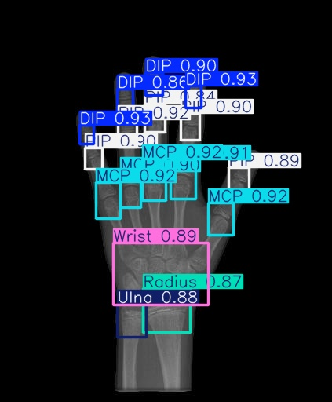
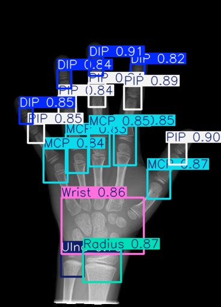
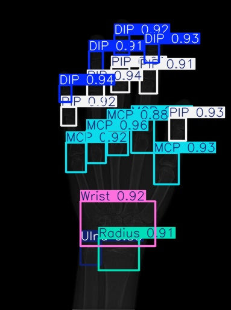

# YOLO11 Object Detection on X-Ray ID (Roboflow)

- Кастомное обучение YOLO11 для детекции меток на рентгеновских снимках.
- Датасет: [X-Ray ID (Roboflow)](https://universe.roboflow.com/rf-projects/x-ray-id)
- Модель: yolov11n.pt
- Основные этапы:
  - Загрузка датасета через Roboflow API
  - Обучение и валидация YOLO11
  - Визуализация результатов
 
Результат работы модели:

  

Матрица корреляция для тренировочной выборки

